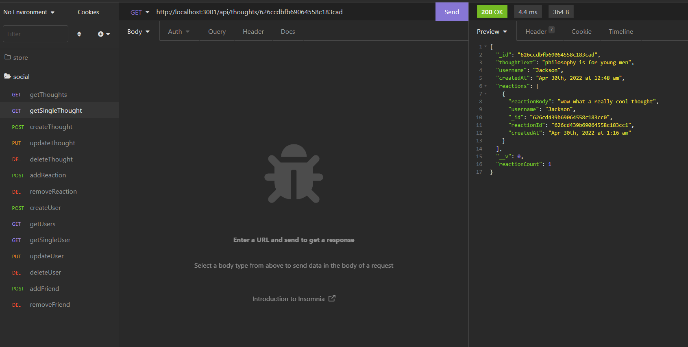

# socialNetworkAPI

This is a server for a social network that allows one to create users, add thoughts and associated reactions, as well as link users as friends.  

Please find the a demonstration video here: <a href="https://watch.screencastify.com/v/rfE7vZVx48oKgWLEmmQ7">Demo Video</a>  

  
For any questions please email me: <a href="mailto:nialvo@protonmail.com">Email</a>